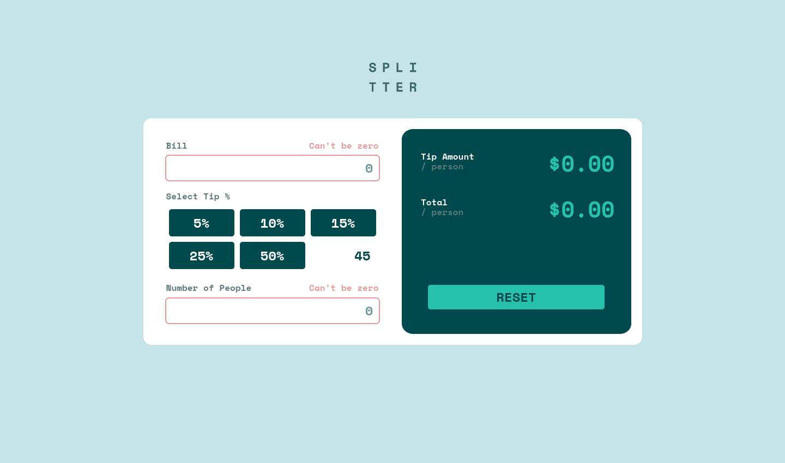

# Frontend Mentor - Tip calculator app


## Welcome! 👋

Thanks for checking out my solution to the tip calculator. This challenge is by Frondend Mentor. I made this over a few days during #100DaysOfCode in January 2022. Later in that same year, I made some small improvements to the design.

## Table of contents

- [Overview](#overview)
  - [The challenge](#the-challenge)
  - [Screenshot](#screenshot)
  - [Links](#links)
- [My process](#my-process)
  - [Built with](#built-with)
  - [What I learned](#what-i-learned)

## Overview

### The challenge

The challenge is to build out this tip calculator app and get it looking as close to the design as possible.

Users should be able to:

- View the optimal layout for the app depending on their device's screen size
- See hover states for all interactive elements on the page
- Calculate the correct tip and total cost of the bill per person

### Links

- Solution URL: [solution URL here](https://www.frontendmentor.io/solutions/tip-calculator-POtUwOBly)
- Live Site URL: [live site](https://michagodfrey.github.io/frontend-mentor-tip-calculator/)

### Screenshots




## My process

### Built with

- Semantic HTML5 markup
- CSS custom properties
- JavaScript
- Mobile-first workflow

### What I learned

I got a lot out of this challenge, the more subtle styles took some fine tuning with the CSS and I got a lot of JavaScript DOM practice.

I got some good practice with psuedo elements on this one. To vertically center the calculator on desktop screens, I used a psuedo element with the Spit Tter image as a background image. The original iteration used an image placed in the header which caused the calculator to sit lower than I wanted on desktop view.

```css

main {
  position: relative;
  margin-top: 150px;
}

main::before {
  background-image: url("images/logo.svg");
  position: absolute;
  content: '';
  background-size: auto;
  background-repeat: no-repeat;
  background-position: center;
  height: 75px;
  width: 100px;
  transform: translateY(-150%);
  left: calc(50% - 50px);
}

```

The JavaScript is a bit verbose in my opinion, and someone more clever than me could probably do this with fewer lines of code. That said, it seems to do the job so I'm pleased with that.
